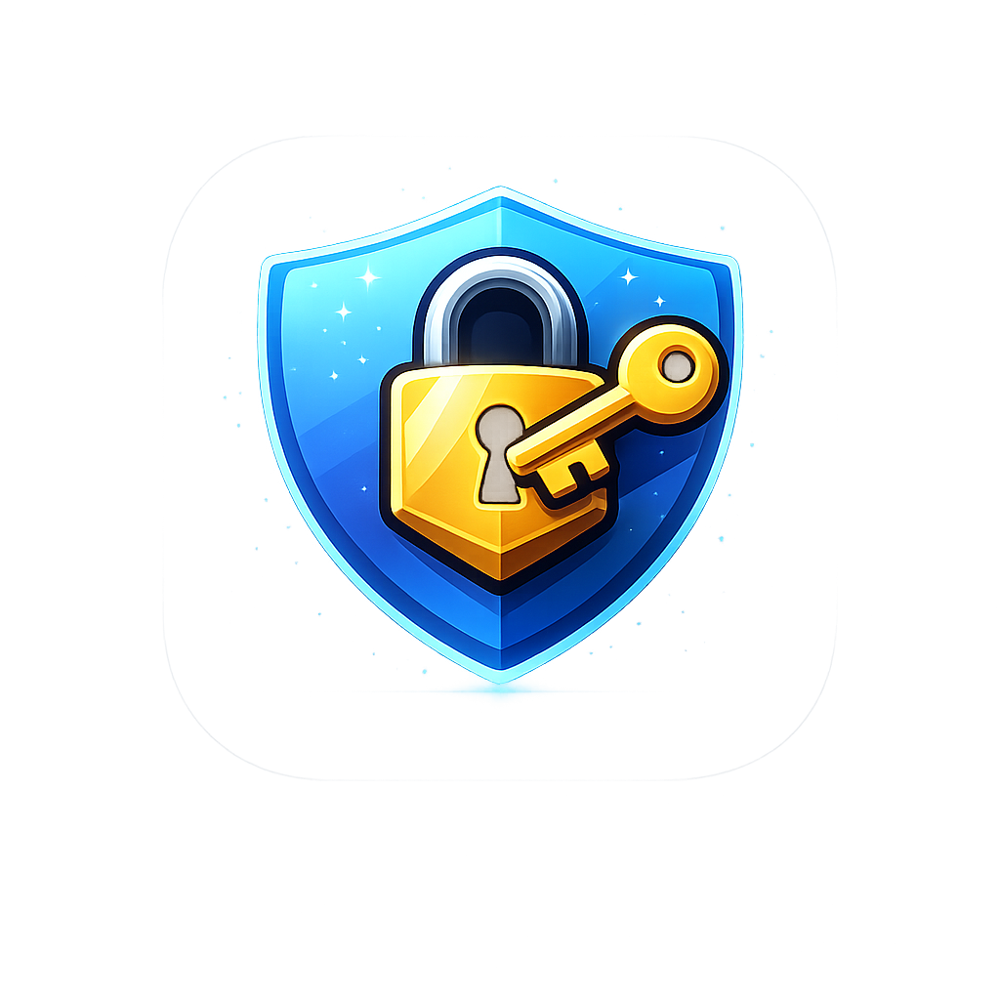

# MiniVault 🔐

MiniVault is a lightweight, privacy-focused password manager that runs directly in your browser.

This version is a **web-based demo** designed to showcase the core functionality of the application without requiring installation.

---

## ✨ Key Features

- **Local-First Storage**  
  All data is stored locally in your browser. No servers, no cloud.

- **Master Password Protection**  
  Access to the vault is protected with a master password.

- **Password Generator**  
  Generate secure passwords instantly.

- **Modern UI**  
  Clean interface inspired by modern applications.

---

## 🌐 Online Demo

You can try the application directly in your browser:

👉 https://ivanbustamante483-dev.github.io/FINAL_PROYECT/

No installation required.

---

## 💻 Desktop Version (Full App)

A more complete and secure desktop version of MiniVault is available in a separate repository:

👉 https://github.com/ivanbustamante483-dev/Proyecto_Digitalizacion

This version includes encrypted file storage and additional security features.

---

## 🚀 How to Use

1. Open the demo link
2. Enter a master password
3. Start adding your credentials
4. Your data will be stored locally in your browser

---

## 🔐 Security Model

### Web Version (this project)

- Data is stored using the browser's `localStorage`
- No files are created on the system
- No data is sent over the internet

⚠️ **Important limitations:**

- Data is tied to your browser and device
- If you:
  - clear browser data
  - delete cookies or site storage
  - switch browser or device

👉 **all stored passwords will be permanently lost**

- The encryption in this version is simplified compared to the desktop version
- This version is intended for demonstration purposes only

---

### Desktop Version (recommended for real use)

- Stores data in a local encrypted file (`vault.json`)
- Uses strong cryptography (PBKDF2 + Fernet encryption)
- Data persists independently of the browser

---

## 📦 Project Structure

- assets/
    - index.html
    - style.css
    - script.js
    - README.md

  
---

## 🤝 Contributing

Contributions are welcome!  
Please check [CONTRIBUTING.md](CONTRIBUTING.md)

---

## 📄 License

This project is licensed under the MIT License  
See the [LICENSE](LICENSE) file for details.

---

## 📸 Usage Examples

### ➤ Creating your vault

1. Open the application in your browser  
2. Enter a master password  
3. Your vault will be initialized  

👉 After this, you can start saving your credentials.

---

### ➤ Adding a new password

1. Click on **"Add"**
2. Enter:
   - Service (e.g. Gmail, Netflix)
   - Username or email
   - Password
3. Save the entry

👉 The credential will appear in the main table.

---

### ➤ Generating a secure password

1. Open the add/edit window  
2. Click on the **generate button 🎲**  
3. A strong password will be created automatically  

👉 You can copy and use it instantly.

---

### ➤ Copying credentials

- Select an entry from the table  
- Click:
  - **"Copy username"**  
  - **"Copy password"**

👉 The password is copied temporarily for security.

---

### ➤ Searching and filtering

- Use the search bar to find services  
- Use the category filter to organize entries  

👉 This helps manage multiple accounts easily.

---

### ➤ Data persistence (important)

- All data is stored in your browser  
- If you refresh the page → data remains  
- If you clear browser data → data is lost  

👉 This is a limitation of the web demo version.
